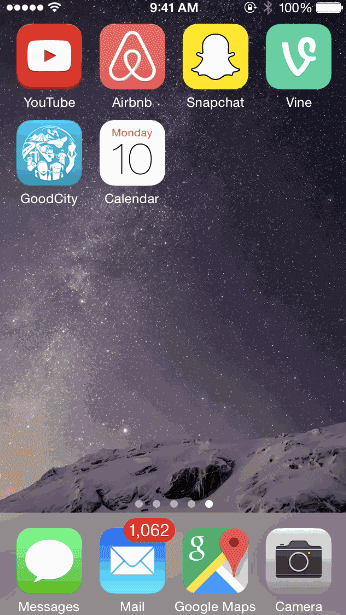

# GoodCity (CodePath iOS Final Project)

### About the Organization
Crossroads Foundation is a Hong Kong based non-profit organisation. Our goal is to connect people in a broken world. As our name suggests, we try to be a crossroads: bringing together those in need and those who can help through providing donations to those in need and working with strategic partners. 

### About the App
The GoodCity app provides an easy way for people to donate items to those in need and for the Crossroads organization to review and approve items. The app also helps people that donate find drop-off locations and coordinate pickups while provides notifications through the whole process. 

The goal of the GoodCity program is to help more than 4000 families in HongKong with donated items each year, and to avoid over 1000 ton of landfill waste. 

## User Stories
### Donor Side:
* [x] Register and login with Facebook login
* [x] Create a new donation
  * [x] Snap a photo
  * [x] Fill in a description
  * [x] Select the item condition
* [x] Review draft items and delete
* [x] Ability to quickly swipe between the donation, pending items, and approved items views
* [x] View all the pending items
* [x] View a list of approved items
* [x] Schedule a pick up for the approved items
  * [x] Select a date and view a list of available pick up slots
  * [x] Set the pick up location
* [x] View a map of all drop off locations
* [x] View donation history of picked up and not needed items
* [x] Track pick up view - see where the volunteer is 
* [x] View user profile to see the total number of donated items
  * [x] Share stats to facebook and twitter

### Notifications:
* [x] Get notified about approved items
* [x] Get norified when the volunteer is on the way to pick up donation items
* [x] Today view widget integration

### Reviewer / Volunteer Side:
* [x] Log in as a volunteer
* [x] Review a list of submitted items - tinder style. Swipe left to reject; swipe right to approve
* [x] Go online to driver mode to pick up items

# Walkthrough
### App Overview

### Submit new items

### Track pickup

# Setup
- Run 'pod install' to pull in the necessary pods
